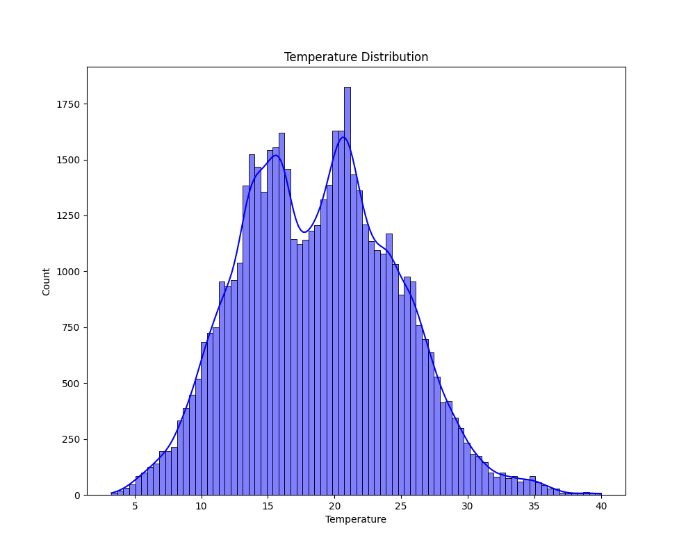
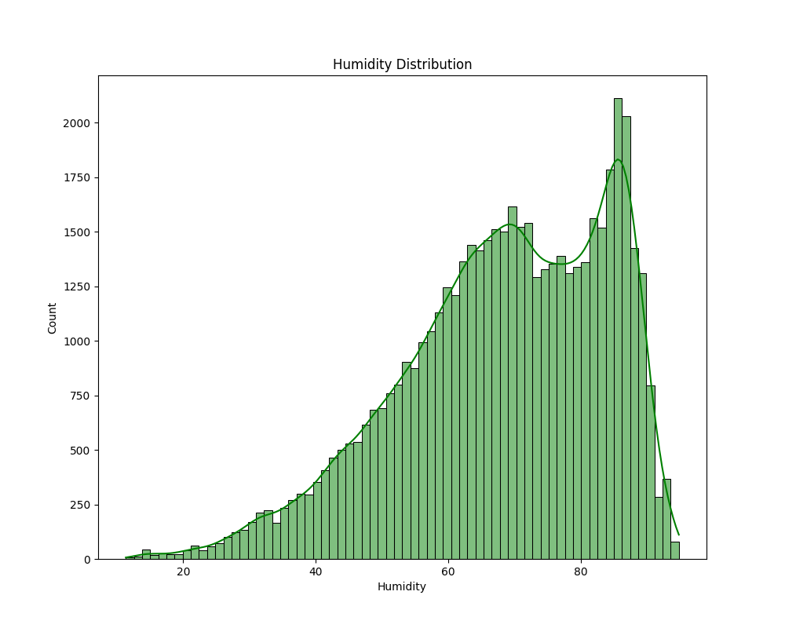
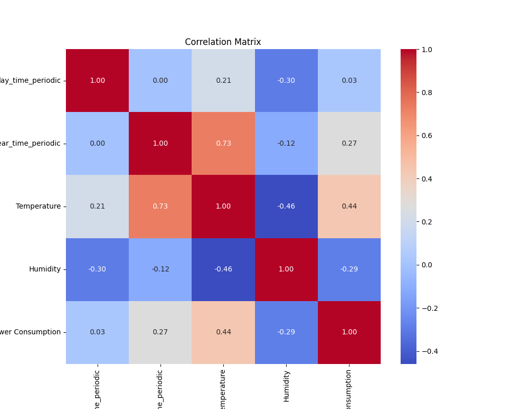
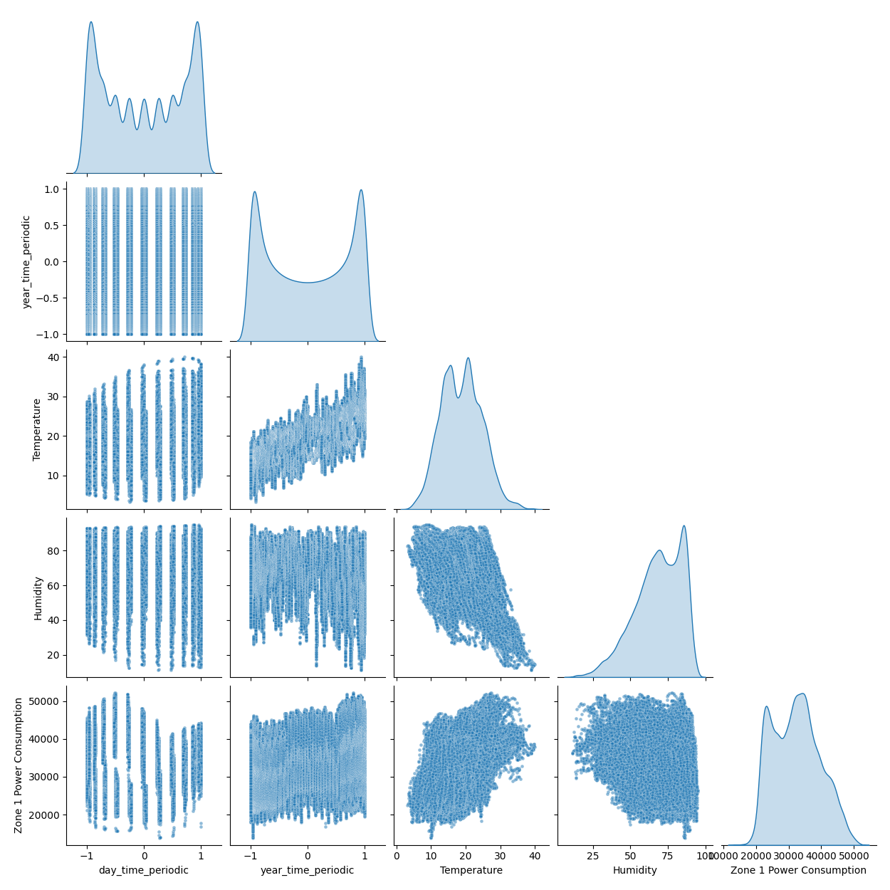

# Environmental 

Dataset. The Power Consumption of Tetouan City dataset (UCI ML Repository) is a multivariate time-series collected in Tetouan, Morocco, containing 52,417 timestamped records at 10-minute intervals. It includes weather features (Temperature, Humidity, Wind Speed, General diffuse flows, Diffuse flows) and power consumption for three distribution zones (Zone 1–3). No missing values are reported.  

Scope of this project. We modeled Zone 1 power consumption using only Time, Humidity, and Temperature as predictors.

Time encoding. To capture cyclic patterns, time was encoded as “time of day” and “time of year” with periodic features:

$$
\text{time of the day}
= -\cos\!\left( 2\pi \cdot \frac{h}{24} + \frac{m}{60\cdot 24} \right)
$$

$$
\text{time of the year}
= -\cos\!\left( 2\pi \cdot \frac{d}{365} + \frac{h}{24\cdot 365} \right)
$$

\[
\text{where } h\in[0,23]\ \text{(hour)},\quad
m\in[0,59]\ \text{(minute)},\quad
d\in\{1,\dots,365\}\ \text{(day of year)}.
\]

[Dataset](https://archive.ics.uci.edu/dataset/849/power%2Bconsumption%2Bof%2Btetouan%2Bcity)

## Data Exploration

{ width="45%" }
{ width="45%" }
{ width="75%" }
{ width="75%" }
